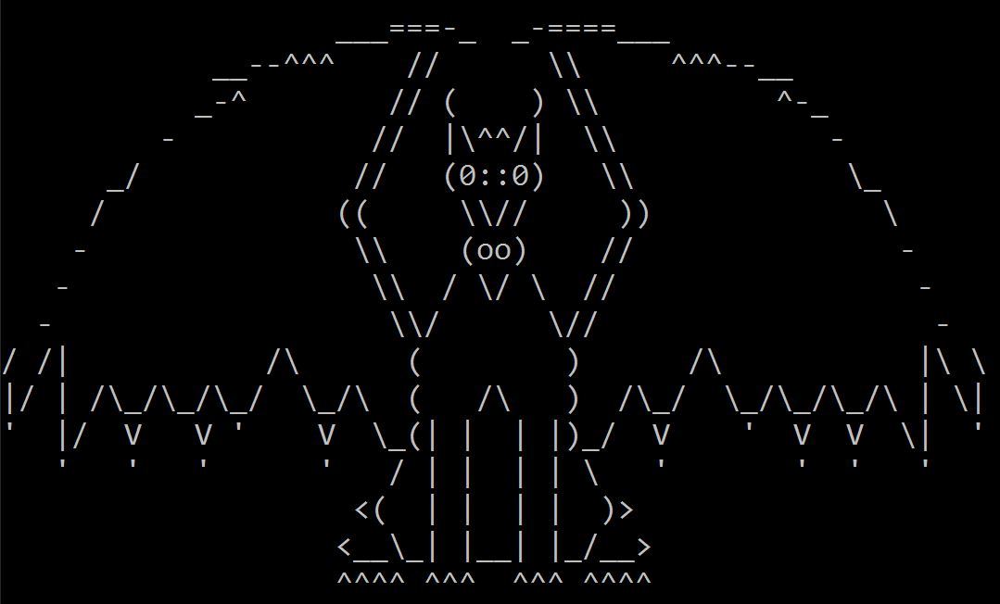
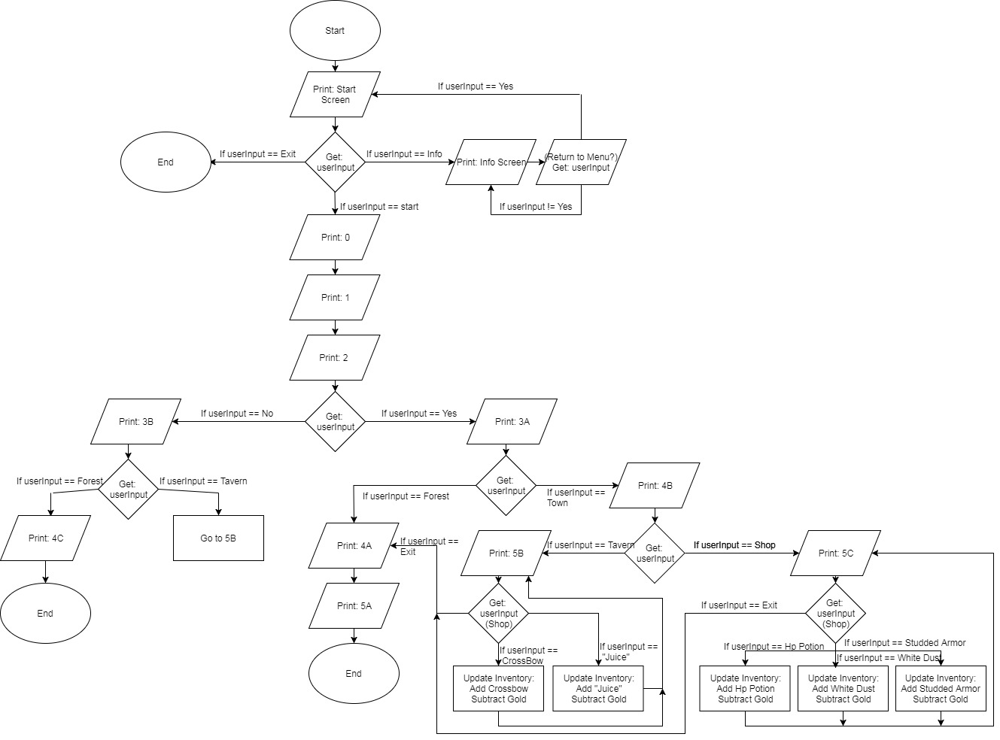

<h1 align="center">
  <br>
  :fire: Kingdom Harbinger :fire:
  <br>
</h1>

<h1 align="center">

</h1>

<h4 align="center">A text-based story DnD game where your character's fate lies right under your finger tips.
</h4>

<p align="center">
  <a href="#about">About</a> •
  <a href="#key-features">Key Features</a> •
  <a href="#download">Download</a> •
  <a href="#video">Video</a> •
  <a href="#creators">Creators</a> •
  <a href="#license">License</a>
</p>



<h1 align="center">About
</h1>

 * Kingdom Harbinger is a text-based story game where you'll be traveling along as a Rogue!
 * Your objective is to complete multiple stages and tasks which will lead you to the end.
 * Different choices lead you into choosing if you're going to be a good, bad, or neutral character.
 * You may survive and may also die.
 * DnD based.
 
 ## :point_right: Key Features
 
1. Shop System

      a. Has a shop system that is able to let you purchase rope, potions, and swords. You'd need to earn enough gold throughout the course of the game in order to buy the item you desire. If the user does not have enough gold, then the output will simply display that you do not have enough gold. 
  
2. Text Art

      a. The coding has many text art in order to enhance the visuals of the game.
  
      b. Makes the game look neat
  
3. Dice simulator

      a. Since this game is DnD, we added a random dice roller.
  
      b. This is to simulate the rolling of dice in a DnD board game.
  
      c. It's portrayed in our game to attack certain characters.
  
      d. Also to show if your attack has reached the target, or missed.
  
4. Colors

      a. Improve visuals for the game.
  
      b. Differentiate which character is which.
  
5. Delays

      a. Improve visuals for the game
       
## :point_right: Download

```bash
#Download repository and run the application.
#After repository is downloaded, run the application in visual studio, then run the debugger by clicking the green arrow at the top.
```

## :point_right: Video

## :point_right: Creators
       -Jimmy Thai
  
       -Shawn Herrick
       
## :point_right: License

        MIT

